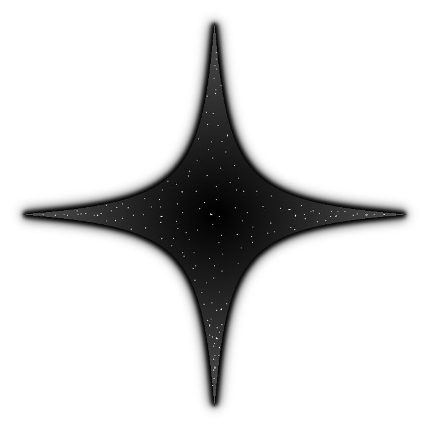

<p align="center">
  
</p>

# Stardark

A small programming language built from scratch in Java, with a tree-walking interpreter and a bytecode compiler + VM

Very w.i.p

## Planned features

- Scanner and parser producing an AST
- Tree-walking interpreter
- Bytecode compiler and stack-based VM
- Benchmarks comparing the interpreter and the VM

## Example
(Blocks open with `do` and close with `end`. Comments start with `!`.)
```
! recursive fibonacci
func fib(n)
    check n < 2 do
        ret n
    end
    ret fib(n - 1) + fib(n - 2)
end

for i = 0, 10 do
    print fib(i)
end

! grading with else check
var score = 85

check score >= 90 do
    print "A"
else check score >= 80 do
    print "B"
else
    print "C or below"
end
```

## Build and run

```bash
javac -d out src/stardark/*.java
java -cp out stardark.Main
```

## Status

- [ ] Scanner
- [ ] Parser
- [ ] Interpreter
- [ ] Compiler
- [ ] VM
